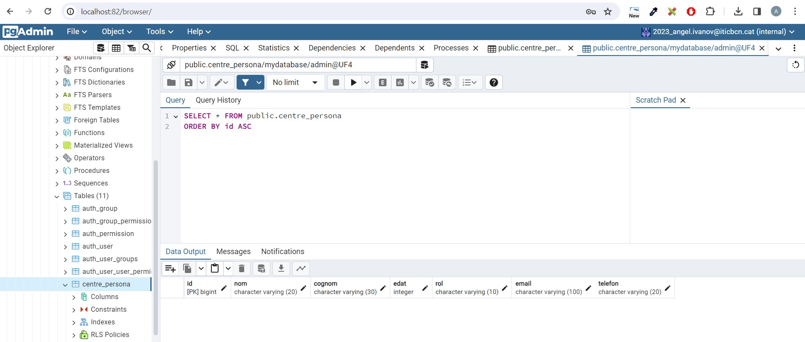

# M7_UF4

## Imatges de la pràctica 1 (VIEWS i TEMPLATES)

+ Captura del index de l'app centre

+  Captura del llistat d'alumnat

+  Captura del llistat de professorat

## Imatges de la pràctica 2 (MODEL)

+ Captura de Register Server

+ Captura de Register server connection

+ Captura de l'execucio de l'ordre de makemigrations

+ Captura de l'execucio de l'ordre migrate

+ Captura de la taula creada despres de l'execucio de makemigrations i migrate

## Imatges de la pràctica 3 (FORM)

+ Captura del formulari creat i amb l'as_p mètode

+ Captura del formulari creat sense l'as_p mètode

